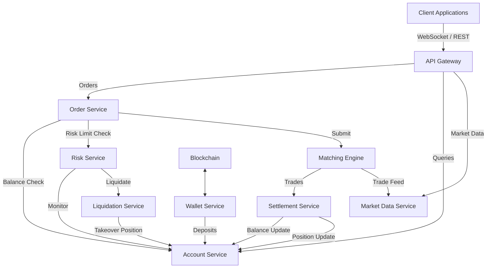

# Architecture Overview

**Phase**: Launch & Operational Docs  
**Component**: System Architecture

## 1. System Context

The distributed exchange architecture is designed for high-throughput, low-latency trading while maintaining strict risk controls and cryptographic security. It operates as a series of specialized microservices communicating via both synchronous (gRPC) and asynchronous (event streaming) channels.

The system enforces deterministic behavior, ensuring that given the same input events, the same state transitions occur, facilitating replayability and exact state recreation.

## 2. Global Architecture Diagram

## 3. Core Components

The exchange comprises 9 core microservices, each with defined single-responsibility boundaries.

### 3.1 API Gateway
- **Role**: Entry point for all external traffic.
- **Responsibilities**: Authentication, rate limiting, request validation, routing.
- **Scaling**: Horizontally scalable and stateless.

### 3.2 Order Service
- **Role**: Manages the complete lifecycle of user orders.
- **Responsibilities**: Validation, persistence, query servicing.
- **Dependencies**: Depends on Account Service and Risk Service for pre-trade validation before routing to the Matching Engine.

### 3.3 Matching Engine
- **Role**: The core determinist matching core (HOT PATH).
- **Responsibilities**: Price-time priority matching, trade generation.
- **Performance Constraints**: Target p99 latency < 500μs, handling up to 100,000 orders/sec per symbol.
- **Storage**: In-memory state, vertically scaled per symbol.

### 3.4 Account Service
- **Role**: Source of truth for user balances and positions.
- **Responsibilities**: Optimistic concurrency control, collateral calculation, ledger management.

### 3.5 Settlement Service
- **Role**: Enforces atomic state updates resulting from trades.
- **Responsibilities**: Processing trade events strictly, T+0 settlement, idempotent processing.

### 3.6 Risk Service
- **Role**: Real-time risk monitoring.
- **Responsibilities**: Checking risk limits on new orders and continuous monitoring of account margin ratios to trigger liquidations.

### 3.7 Liquidation Service
- **Role**: System stability enforcement under extreme market conditions.
- **Responsibilities**: Liquidating undercollateralized accounts, insurance fund management, Auto-Deleveraging (ADL).

### 3.8 Market Data Service
- **Role**: Public data dissemination.
- **Responsibilities**: Aggregating trades, maintaining order book mirrors for public querying, calculating mark prices and OHLCV candles.

### 3.9 Wallet Service
- **Role**: Blockchain interaction boundary.
- **Responsibilities**: Tracking on-chain deposits, generating deposit addresses, signing and broadcasting withdrawals.

## 4. Communication Architecture

The system utilizes three primary communication models:

1. **Synchronous (gRPC)**: Used strictly for critical-path operations requiring immediate consistency or rejection (e.g., Order creation, risk checks).
2. **Asynchronous (Event Log)**: Used for high-volume state transitions with at-least-once delivery semantics (e.g., Trade settlements).
3. **Request-Reply (REST/RPC)**: Used for queries and state retrieval where eventual consistency is acceptable.

## 5. Deployment Topology

The core production deployment runs inside isolated VPCs:
- **DMZ**: Contains only the API Gateways and Load Balancers.
- **Internal Application Network**: Houses the compute clusters for all services.
- **Data Network**: Contains databases and event streams with no public internet access.
- **Disaster Recovery**: Multi-region active-passive setup with RPO=0 and tight RTO limits.

---
*Generated according to Launch & Operational Docs requirements. Consistent with Specification v1.0.*
