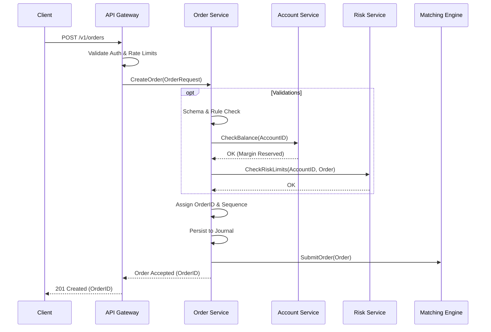
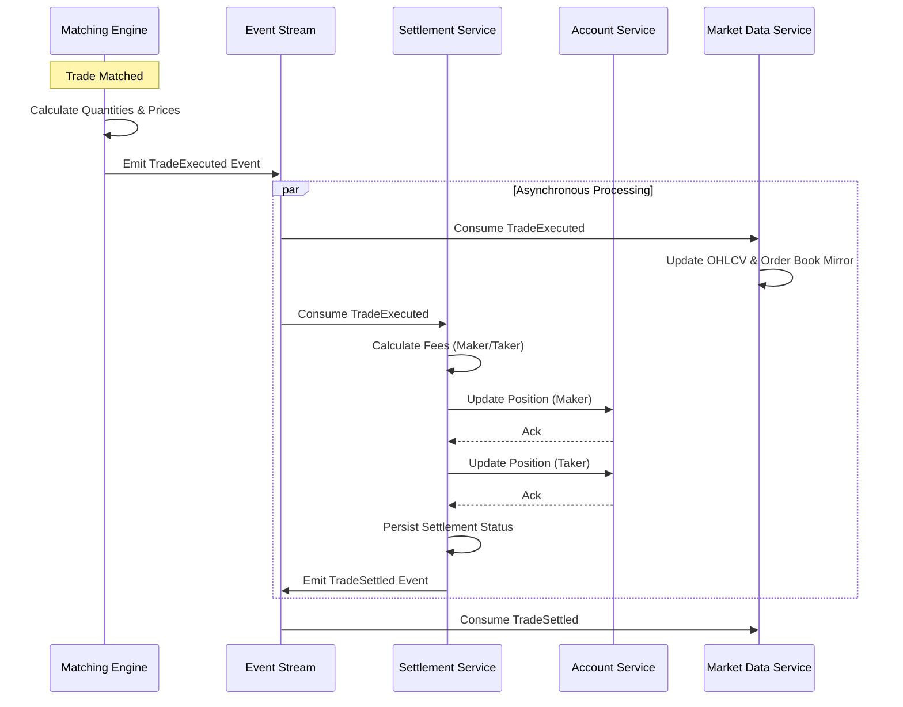
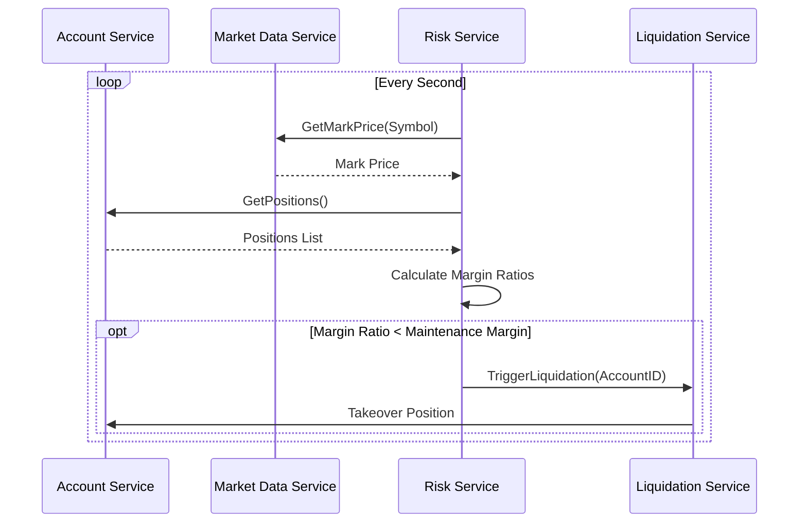

# Service Interaction Document

**Phase**: Launch & Operational Docs  
**Component**: System Architecture

## 1. Overview

This document details the interactions between the distributed exchange's core microservices throughout key flows, specifically order creation, matching, and settlement. These interactions strictly adhere to the Service Boundaries Specification (Spec 09) and Lifecycle Specifications (Specs 01 and 03).

## 2. Order Creation Flow

The order creation flow is latency-critical and relies on synchronous (gRPC) communication to ensure immediate feedback to the client.

## 3. Trade Execution & Settlement Flow

Trade execution happens continuously in the Matching Engine. When a match occurs, the settlement pipeline takes over asynchronously using event streams.

## 4. Failure Isolation Mechanisms

Inter-service communication utilizes circuit breakers to prevent catastrophic cascading failures.

### 4.1 Degraded Operational Modes

- **Order Service -> Matching Engine**: If the Matching Engine becomes unreachable (Circuit Breaker opens after 5 failures), Order Service queues orders or returns a 503 Service Unavailable depending on the queue capacity.
- **Settlement Service -> Account Service**: If the Account Service is unreachable, Settlement Service retries indefinitely (Settlement is idempotent via `trade_id`).
- **Market Data Service Extraction**: Market Data Service can serve stale data if its internal clock or upstream feed is lagging (up to a tolerance limit, commonly 10 seconds).

## 5. Risk & Liquidation Monitoring

Risk Service continually polls or consumes position updates to monitor account health in real time.

## 6. Interface Contracts

All gRPC communications are defined by strict Protobuf definitions located in `/spec/proto/`. Versioning is handled at the URI level (e.g., `/v1/orders`), with a backward compatibility guarantee of 6 months for any deprecated features.
